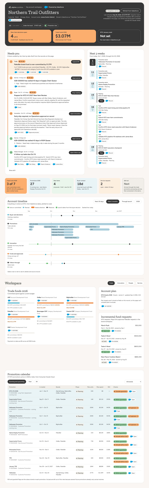


# Alpine Nutrition: headless Salesforce workspaces for Claude

Two single-file web apps that run as [Claude artifacts](https://claude.ai) and read and write a Salesforce Consumer Goods Cloud (TPM) org through the Salesforce connector. Salesforce stays the governed system of record. The workspace is just a surface on top of it.

| Folder | Persona | What it shows |
| --- | --- | --- |
| [`kam-workspace/`](kam-workspace/index.html) | Key account manager on Northern Trail Outfitters | Daily queue, agenda, account timeline, new item reviews, promotions, funds, people, meeting prep, "Ask Claude" |
| [`brand-workspace/`](brand-workspace/index.html) | Brand manager for PaleoBar | Path to store target, retailer decisions (New Item Feedback), buyer feedback themes, launch readiness, trade funding and fund requests, "Ask Claude" |

## How it runs

These pages use the claude.ai artifact runtime (`window.claude.use(...)`). They won't load live data if you open them from GitHub Pages or a local file. Without the runtime they fall back to an embedded snapshot, or to an empty state.

Capabilities each page declares when published:

```json
{
  "mcp": { "servers": [{ "server": "Salesforce", "tools": ["dispatch_readonly", "dispatch"] }] },
  "sample": {}
}
```

- **`mcp`** calls the viewer's own Salesforce connector. Reads use `dispatch_readonly` with REST/SOQL paths (`/services/data/v67.0/query`). Writes (New Item Feedback updates, Fund Request creation) use `dispatch`. Every call runs as the viewer, with the viewer's Salesforce permissions.
- **`sample`** powers the "Ask Claude" panel and the drafted meeting prep.

## Running it against your own org

1. In Claude, connect the **Salesforce** connector to your org.
2. Give Claude one of the `index.html` files and ask it to publish the file as an artifact with the capabilities above.
3. Update the org-specific constants near the top of each page's script:

   | Page | Constant | Meaning |
   | --- | --- | --- |
   | KAM | `ACCOUNT_ID` | Retail account the workspace is about |
   | KAM | `HERO_MATCH` | Name of the item featured in the hero card |
   | Brand | `NTO` | Same retail account ID |
   | Brand | `BRAND` | Product2 ID for the brand |
   | both | `BRAND_MANAGER` / `BM` | Persona name shown in the UI |

4. Remove the embedded `window.__SNAPSHOT__` data from both pages. It's a point-in-time copy of the original demo org.

### Objects the pages expect

Consumer Goods Cloud TPM objects (`cgcloud__Promotion__c`, `cgcloud__Fund__c`, `cgcloud__Account_Plan__c`) and standard objects (Account, Contact, Event, Task, AccountTeamMember, Product, Promotion, ProcessInstance).

Custom objects that **aren't in a stock TPM org** and have to be deployed first:

- `New_Item__c`
- `New_Item_Feedback__c`
- `Fund_Request__c`
- `Account_Support_Request__c`
- `Slack_Channel__c`

The field names are in the SOQL inside each page. A metadata package for these objects isn't in this repo yet.

## Notes

- Data in the pages comes from a Salesforce demo org: Alpine Nutrition and Northern Trail Outfitters are fictional, and contact details use `.example` domains and 555 numbers.
- The pages load fonts from Google Fonts and libraries from cdnjs and jsDelivr.

## Screenshots

These are full-page captures at 1440px wide, rendered from each page's embedded Salesforce snapshot (Sep 28 and Sep 29, 2026). Click an image for full resolution.

### KAM workspace: Northern Trail Outfitters

<a href="docs/screenshots/kam-workspace.png"></a>

### Brand workspace: PaleoBar

<a href="docs/screenshots/brand-workspace.png"></a>
